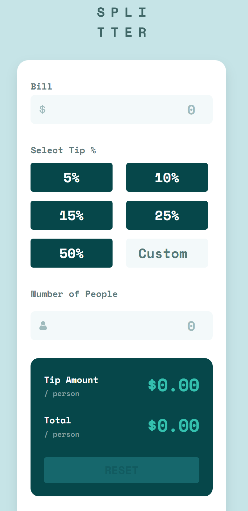
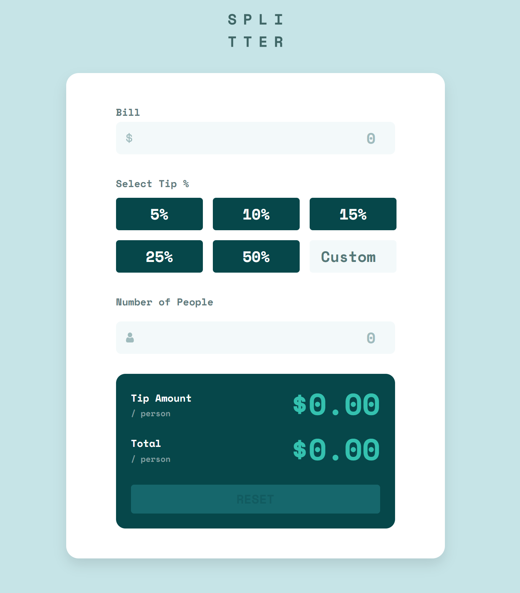
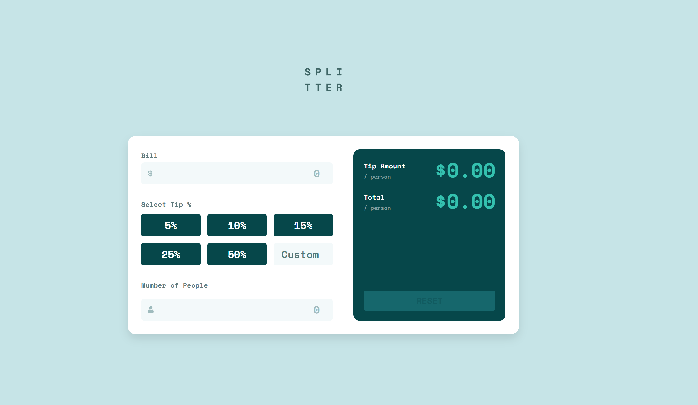

Tip Calculator App

This is a solution to the [Tip Calculator App challenge on Frontend Mentor](https://www.frontendmentor.io/challenges/tip-calculator-app-ugJNGbJUX). The challenge involves building a tip calculator that calculates the tip and total per person based on user inputs, with a responsive design for mobile, tablet, and desktop.

## Table of Contents

- [Overview](#overview)
  - [The Challenge](#the-challenge)
  - [Screenshots](#screenshots)
  - [Links](#links)
- [My Process](#my-process)
  - [Built With](#built-with)
  - [What I Learned](#what-i-learned)
  - [Continued Development](#continued-development)
- [Setup](#setup)
- [Author](#author)

## Overview

### The Challenge

Users should be able to:

- View the optimal layout for the app depending on their device's screen size.
- See hover states for all interactive elements on the page.
- Calculate the correct tip and total cost of the bill per person.

### Screenshots

#### Mobile (375px)

#### Tablet (768px)

#### Desktop (1440px)

### Links

- Solution URL: [GitHub Repository](https://github.com/your-username/tip-calculator-app)
- Live Site URL: [Live Demo](https://your-username.github.io/tip-calculator-app/) _(Optional, if deployed)_

## My Process

### Built With

- Semantic HTML5 markup
- CSS custom properties
- Flexbox and Grid for layout
- Mobile-first workflow
- Vanilla JavaScript for calculations and interactivity
- Git and GitHub for version control

### What I Learned

- Improved my understanding of responsive design using a mobile-first approach.
- Gained experience with JavaScript event listeners and DOM manipulation for dynamic calculations.
- Learned to handle edge cases (e.g., preventing `$NaN` outputs, validating inputs).

### Continued Development

I plan to enhance this project with additional features, including:

- A tip history log to track past calculations.
- Custom tip presets for user-defined percentages.
- A split payment breakdown for detailed per-person contributions.
- A currency selector for multi-currency support.
- A dark mode toggle for better usability.
- A shareable link to share calculations via URL.

## Setup

To run this project locally:

1. Clone the repository: `git clone https://github.com/your-username/tip-calculator-app.git`
2. Navigate to the project directory: `cd tip-calculator-app`
3. Open `index.html` in a browser, or use a local server (e.g., VS Code Live Server).

## Author

- Name: [Brian Meinert]
- Frontend Mentor: [@your-username](https://www.frontendmentor.io/profile/bmeinert8)
- GitHub: [your-username](https://github.com/bmeinert8)
